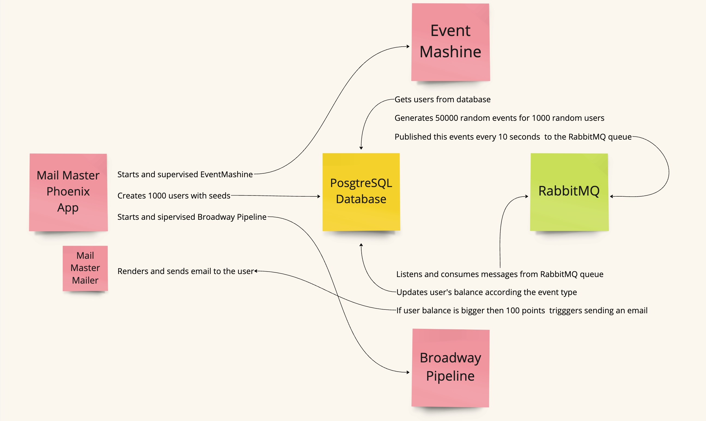

# Mail Master

## Links

[Магия Elixir в рассылке e-mail / Александр Швец (Xeteq)](https://www.youtube.com/watch?v=aovuXqDrtNo) (High Load Channel)

[Idempotent seeds in Elixir](https://bitcrowd.dev/idempotent-seeds-in-elixir/) (Article)

[Elixir: The Wickedly Awesome Batch and Stream Processing Language You Should Have in Your Toolbox](https://www.youtube.com/watch?v=4c6tY0dLni4&t=2s) (YouTube Talk)

[Insert 19 million rows with Elixir/Phoenix and PostgreSQL](https://medium.com/@r_trojanowski/working-with-a-huge-dataset-with-elixir-and-phoenix-94875e4169a5) (Medium Article)

[Broadway, RabbitMQ, and the Rise of Elixir part 1](https://akoutmos.com/post/broadway-rabbitmq-and-the-rise-of-elixir) (Blog)

[Broadway, RabbitMQ, and the Rise of Elixir part 2](https://akoutmos.com/post/broadway-rabbitmq-and-the-rise-of-elixir-two/) (Blog)
 
