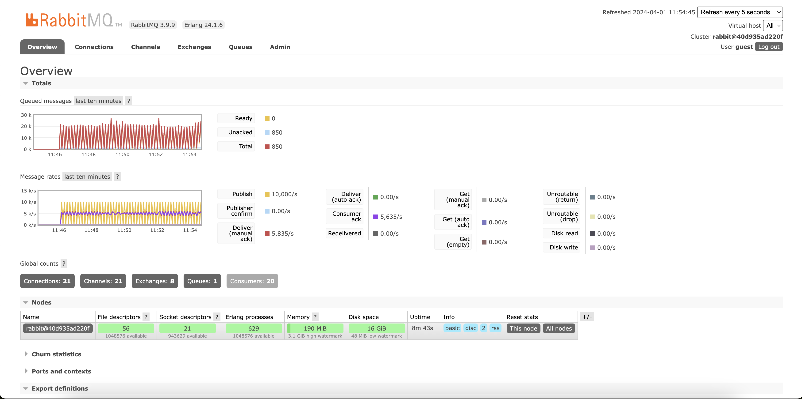

# Mail Master

A scatch of event driven architecture using Elixir and  Broadway with RabbitMQ. In this architecture, Elixir/Phoenix applications communicate asynchronously via RabbitMQ using the AMQP protocol. RabbitMQ serves as the message broker, facilitating event distribution. Broadway, a streaming library, processes incoming messages, enabling scalable and fault-tolerant data processing pipelines. 

## Architectual Overview

## RabbitMQ metrics

## Docs 

[mix release](https://hexdocs.pm/mix/Mix.Tasks.Release.html)

[Deploying Phoenix with Releases and Containers](https://hexdocs.pm/phoenix/releases.html)

## Next Steps 

[Kafka vs. RabbitMQ vs. Messaging Middleware vs. Pulsar](https://www.youtube.com/watch?v=x4k1XEjNzYQ)

[Apache Kafka Architecture](https://www.youtube.com/watch?v=IsgRatCefVc)

## Monitoring

[How to monitor Containers in Kubernetes using Prometheus & cAdvisor & Grafana? CPU, Memory, Network](https://www.youtube.com/watch?v=dMca4jHaft8&t=254s)

## Links

[Delivering social change with Elixir at Change.org](https://elixir-lang.org/blog/2020/10/27/delivering-social-change-with-elixir-at-change.org/)

[Магия Elixir в рассылке e-mail / Александр Швец (Xeteq)](https://www.youtube.com/watch?v=aovuXqDrtNo) (High Load Channel)

[Idempotent seeds in Elixir](https://bitcrowd.dev/idempotent-seeds-in-elixir/) (Article)

[Elixir: The Wickedly Awesome Batch and Stream Processing Language You Should Have in Your Toolbox](https://www.youtube.com/watch?v=4c6tY0dLni4&t=2s) (YouTube Talk)

[Insert 19 million rows with Elixir/Phoenix and PostgreSQL](https://medium.com/@r_trojanowski/working-with-a-huge-dataset-with-elixir-and-phoenix-94875e4169a5) (Medium Article)

[Broadway, RabbitMQ, and the Rise of Elixir part 1](https://akoutmos.com/post/broadway-rabbitmq-and-the-rise-of-elixir) (Blog)

[Broadway, RabbitMQ, and the Rise of Elixir part 2](https://akoutmos.com/post/broadway-rabbitmq-and-the-rise-of-elixir-two/) (Blog)

### UI 

- Phoenix Storybook, for show-casing and documenting your ui components: https://github.com/phenixdigital/phoenix_storybook

- BloomUI, a very newish UI component library inspired by shadcn for React: https://bloom-ui.fly.dev

- Petal Components: https://github.com/petalframework/petal_components

- SurfaceUI, heex originated in this project: https://surface-ui.org/getting_started

- PrimerLive, following GitHubs Primer Design System: https://primer-live.org, https://github.com/ArthurClemens/primer_live
 
